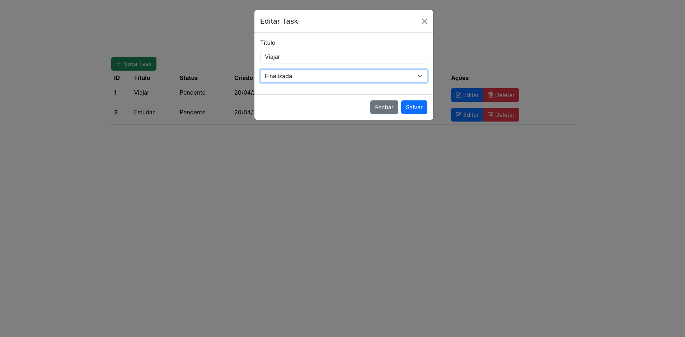

# Exemplo de CRUD com FatAPI
Este é um projeto de exemplo básico de um CRUD em Python utilizando FastAPI, TinyDB e Jinja2.

## Imagens do projeto
- Página inicial 
- Menu nova task 
- Menu editar task 
- Menu deletar task 
- Página de documentação da API 